# E-commerce Funnel and Customer Decision Analysis

## Executive Summary

This project analyzes e-commerce customer behavior across five monthly event files covering **October 2019 through February 2020**, with a focus on the journey from product discovery to purchase and the commercial value of different purchase paths. Using a session-based funnel and purchase-path segmentation, the analysis identifies where customers abandon the journey, how revenue is distributed across Immediate, Delayed, and Direct purchase paths, and which customer/product patterns deserve management attention. The analysis shows that the funnel loses **81.6% of sessions between product view and view+cart** and a further **86.5% between view+cart and purchase**, while the Immediate path contributes **68.4% of purchase sessions and 68.4% of revenue**.

## Why I Built This Project

I built this project to move beyond descriptive e-commerce reporting and demonstrate how event-level behavioral data can be converted into commercially relevant decisions.

The technical learning objectives were to:

- Transform millions of raw behavioral events into session-level analytical tables.
- Design both a **non-nested funnel** and a **strict nested funnel** to distinguish stage presence from true sequential progression.
- Segment purchasing sessions into **Immediate, Delayed, and Direct** customer paths.
- Compare conversion, revenue, AOV, basket size, customer type, time-of-day behavior, and product/category performance.
- Translate analytical outputs into recommendations that a product, growth, merchandising, or commercial team could act on.

## Business Context

E-commerce businesses generate large volumes of clickstream events, but event counts alone do not explain commercial performance. The important business questions are whether customers progress through the buying journey, where they abandon, which paths generate revenue, whether purchase behavior differs between new and returning customers, and which products/categories concentrate demand.

This project addresses that gap by converting event-level activity into a **decision-oriented customer journey and revenue analysis**. The output is designed to support decisions around funnel optimization, checkout/cart recovery, merchandising priorities, customer retention, and trading-hour focus.

## Problem Statement

The core problem is to determine:

1. Where the customer journey experiences the largest measurable drop-offs.
2. How purchasing sessions differ by behavioral path.
3. Which paths contribute disproportionate or material shares of revenue.
4. Whether new versus returning purchasing users change the composition of performance over time.
5. When customers are most commercially active by weekday and hour.
6. Which product and category groups generate the strongest purchase-session and revenue contribution.

## Hypotheses

The analysis was structured around the following hypotheses:

- **H1 — The largest funnel losses occur before purchase.**  
  A substantial share of product-view sessions will fail to progress to cart or purchase.

- **H2 — Customers who show a complete in-session view → cart → purchase sequence form the dominant purchase path.**  
  This is expected to be reflected in both purchase-session share and revenue share.

- **H3 — Delayed purchasers represent a commercially meaningful secondary path.**  
  Customers who viewed/carted before purchasing in a later session may account for a material share of revenue.

- **H4 — Purchase economics differ by path.**  
  AOV and basket size may vary between Immediate, Delayed, and Direct purchasers.

- **H5 — Demand is not evenly distributed across time.**  
  Purchase sessions and revenue will vary by weekday and hour, creating potential opportunities for operational and promotional optimization.

- **H6 — Product and category demand is concentrated.**  
  A relatively small number of products/categories are expected to contribute a meaningful share of purchase sessions and revenue.

## Dataset Overview

### Source Files

Data Source - https://www.kaggle.com/datasets/mkechinov/ecommerce-events-history-in-cosmetics-shop/data

**Coverage:** October 2019 to February 2020.

The notebook reports **20,692,840 rows and 10 columns** after the monthly files are combined and the month field is added.

### Event Types

The analysis contains four event types:

| Event Type | Events |
|---|---:|
| View | 9,657,790 |
| Cart | 5,764,557 |
| Remove from cart | 3,978,888 |
| Purchase | 1,287,007 |

### Key Fields

The analytical dataset contains fields including:

`event_time`, `event_type`, `product_id`, `category_id`, `category_code`, `brand`, `price`, `user_id`, `user_session`, and `event_month`.

### Data Quality

The notebook identifies missing values in several fields:

- `user_session`: **4,598 missing rows**
- `category_code`: **20,339,246 missing values**
- `brand`: **8,757,117 missing values**

For the session-based funnel, rows without `user_session` are removed because a session is the primary unit used to reconstruct the customer journey.

`category_code` and `brand` remain incomplete; therefore, conclusions using those fields should be treated as limited unless additional enrichment or imputation is introduced.

## Tools Used

- **Python**
- **Pandas** — data preparation, session aggregation, KPI calculations
- **NumPy** — conditional logic and numerical transformations
- **Matplotlib** — business visualizations
- **Plotly Express** — exploratory visualization
- **Jupyter Notebook** — analysis workflow and documentation
- **Git / GitHub** — version control and portfolio presentation

## Data Preparation

The preparation workflow follows this sequence:

1. Load the five monthly CSV files.
2. Add a standardized `event_month` field to preserve monthly provenance.
3. Concatenate the monthly datasets.
4. Inspect schema, data types, event counts, and missing values.
5. Remove rows with missing `user_session` for session-level analysis.
6. Convert `event_time` from string to datetime.
7. Build session-level flags for:
   - `has_view`
   - `has_cart`
   - `has_purchase`
8. Construct a strict nested funnel using session flags.
9. Build purchase-session tables containing:
   - user
   - session
   - purchase time
   - revenue
   - item count
10. Classify purchase sessions into:
   - **Immediate** — view + cart + purchase occur within the purchasing session.
   - **Delayed** — purchase occurs after earlier view/cart activity.
   - **Direct** — purchase sessions not matching the Immediate or Delayed conditions.
11. Create monthly, weekday, hourly, category, and product aggregates.
12. Classify purchasing users as **New** or **Returning** based on their first observed purchase month.

## Analysis Approach

### 1. Funnel Analysis

Two funnel definitions are used intentionally:

**Non-nested funnel:** measures whether a session contains a view, cart, or purchase event independently.

**Nested funnel:** measures true sequential progression:

`View → View + Cart → View + Cart + Purchase`

The nested funnel is used for the main abandonment story because it avoids treating separate stage activity as if it occurred in one continuous journey.

### 2. Purchase-Path Segmentation

Purchases are segmented into:

- **Immediate**
- **Delayed**
- **Direct**

This allows the analysis to distinguish customers who convert directly within the same session from customers whose purchase follows earlier engagement.

### 3. Commercial Performance

For each path, the analysis compares:

- Purchase sessions
- Unique purchasing users
- Revenue
- Revenue share
- Session share
- AOV
- Average basket size
- Median basket size
- Average selling price per purchased item/session

### 4. Time-Based Analysis

Performance is examined across:

- Month
- Weekday
- Hour of day

This is intended to reveal demand concentration and potential timing opportunities.

### 5. Customer Mix

Purchasing users are classified as:

- **New**
- **Returning**

Monthly changes in this mix help separate acquisition-driven performance from repeat-purchase behavior.

### 6. Product & Category Analysis

The analysis identifies top categories and products by:

- Purchase sessions
- Revenue
- Items sold

The intent is to connect customer-path behavior with merchandising and revenue concentration.

## Key KPIs Tracked

| KPI | Definition / Business Use |
|---|---|
| Funnel conversion rate | Measures progression from one journey stage to the next |
| Funnel drop-off rate | Quantifies sessions lost at each stage |
| Purchase-session share | Measures contribution of each purchase path |
| Revenue share | Measures commercial contribution of each path |
| AOV | Revenue per purchasing session |
| Average basket size | Items purchased per purchasing session |
| Median basket size | Typical basket depth, less sensitive to outliers |
| Average selling price | Revenue per item purchased |
| New-user share | Mix of first-time purchasing users |
| Returning-user share | Mix of repeat purchasing users |
| Revenue by weekday | Identifies demand concentration by day |
| Revenue by hour | Identifies demand concentration by time |
| Category revenue | Identifies commercially important categories |
| Product revenue | Identifies commercially important products |

## Key Insights

- **The strict funnel loses 81.6% of sessions from View to View + Cart.**  
  4,280,701 sessions contain a view, but only 788,430 contain both a view and a cart.

- **The cart-to-purchase transition is an even larger relative bottleneck.**  
  Only 13.5% of View + Cart sessions progress to View + Cart + Purchase, leaving an **86.5% drop-off** at this stage.

- **106,526 sessions complete the full nested View → Cart → Purchase journey.**  
  This is the strictest measure of in-session funnel completion in the notebook.

- **The Immediate path is the dominant commercial path.**  
  It represents **106,526 purchase sessions**, **68.45% of purchase sessions**, and **68.40% of revenue**.

- **Delayed purchasing is commercially meaningful rather than marginal.**  
  Delayed purchases account for **48,250 sessions**, **31.01% of purchase sessions**, and **30.99% of revenue**.

- **Direct purchasing is a very small share of observed purchasing activity.**  
  Direct represents **0.54% of purchase sessions** and **0.61% of revenue** under the notebook's path definition.

- **AOV is broadly similar between Immediate and Delayed purchasers.**  
  Immediate AOV is approximately **40.76**, while Delayed AOV is approximately **40.77** in the notebook output. Their similarity suggests that the commercial opportunity is more strongly related to conversion journey optimization than to radically different order values.

- **Direct purchases have the highest reported AOV and basket size, but on a very small base.**  
  Direct AOV is **46.08** and average basket size is **9.55**, so this segment should not be prioritized without validating its statistical stability.

- **The dataset is large enough to support granular behavioral analysis.**  
  More than 20 million event rows are analyzed, enabling month-, day-, hour-, category-, product-, and session-level comparisons.

## Business Impact

The project converts raw clickstream data into a set of commercial decision levers:

**Funnel optimization:** The largest losses occur before purchase, especially after cart creation. This directs attention toward product-page/cart usability, pricing clarity, trust signals, shipping visibility, payment friction, and checkout experience.

**Recovery strategy:** Since Delayed purchases contribute nearly one-third of purchase sessions and revenue, remarketing and cart-recovery programs can be evaluated as an incremental revenue lever rather than treating every non-immediate session as lost demand.

**Merchandising:** Top products and categories provide a data-backed basis for prioritizing inventory visibility, cross-sell placements, promotions, and homepage/category merchandising.

**Trading calendar:** Weekday and hourly analysis can inform promotional timing, staffing, campaign scheduling, and operational capacity planning.

**Customer strategy:** New-versus-returning trends can help distinguish growth generated by acquisition from growth generated by repeat purchasing.

## Important Charts

Store exported, presentation-ready visuals in `/charts`.

### Funnel & Path Analysis

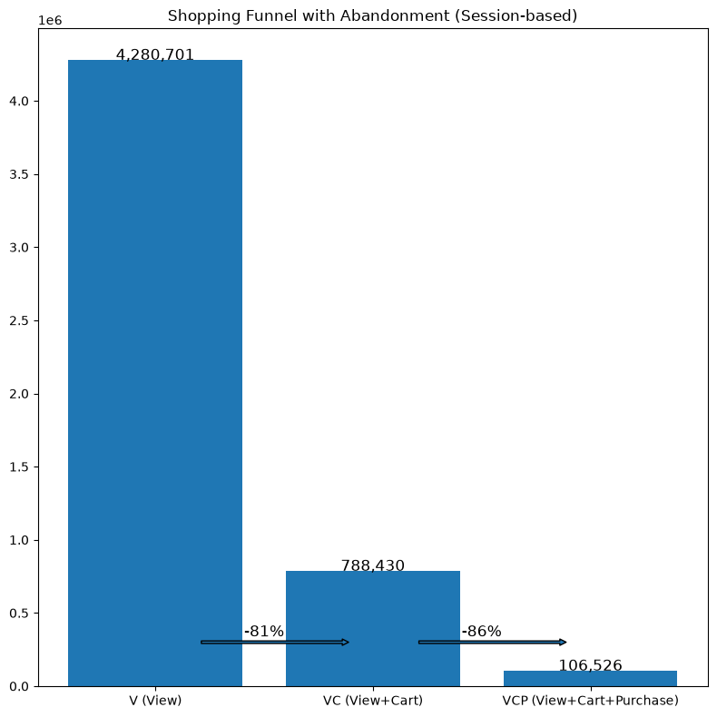

**Insight:** Shows the strict View → View + Cart → View + Cart + Purchase progression and highlights the largest abandonment points.

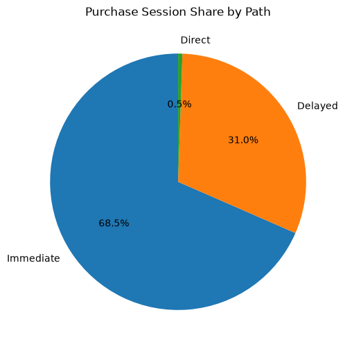

**Insight:** Shows how purchasing activity is distributed across Immediate, Delayed, and Direct paths.

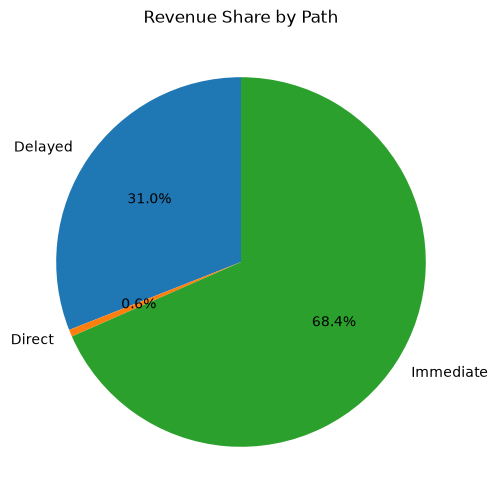

**Insight:** Shows whether path share translates into proportional commercial value.

### Commercial Performance

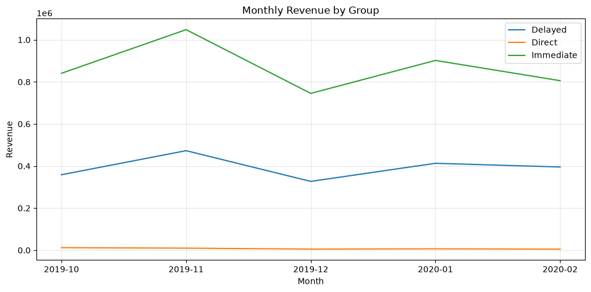

**Insight:** Compares revenue trends by purchase path over time.

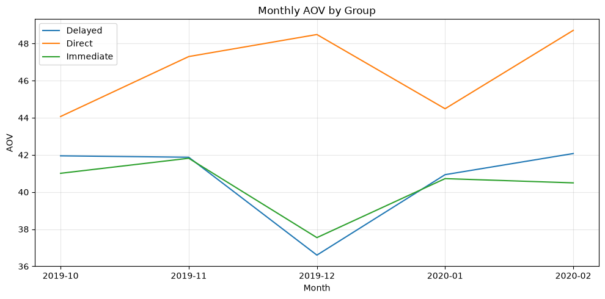

**Insight:** Tests whether order economics change by path and over time.

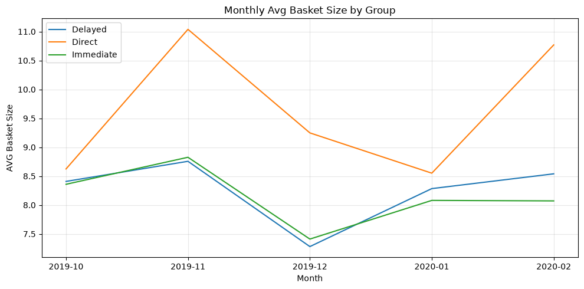

**Insight:** Identifies changes in items purchased per purchasing session.

### Customer Composition

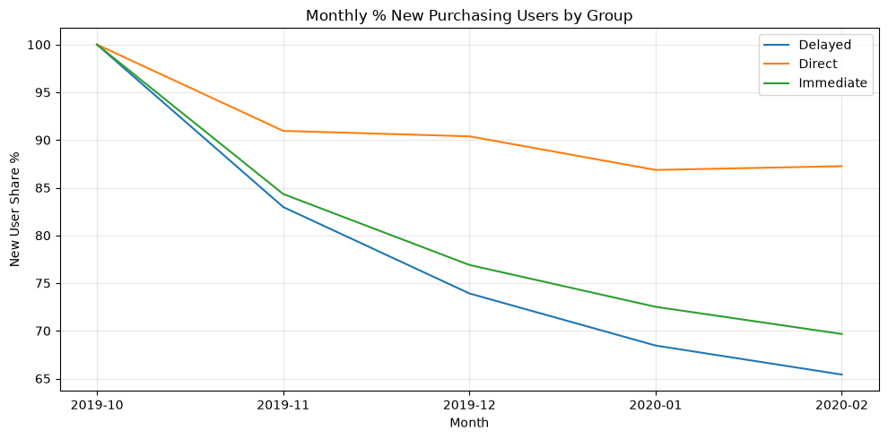

**Insight:** Shows whether monthly purchasing activity is becoming more acquisition-led or retention-led.

### Timing

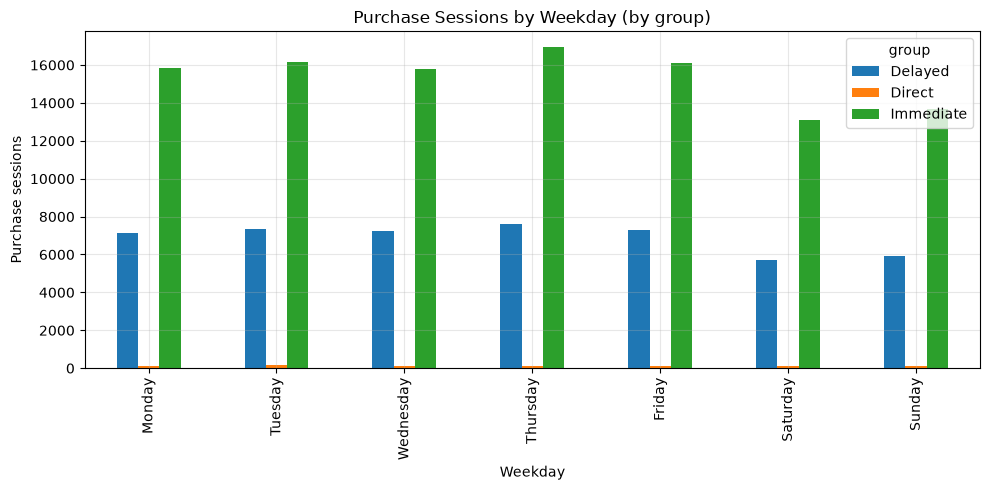

**Insight:** Highlights weekday demand concentration.

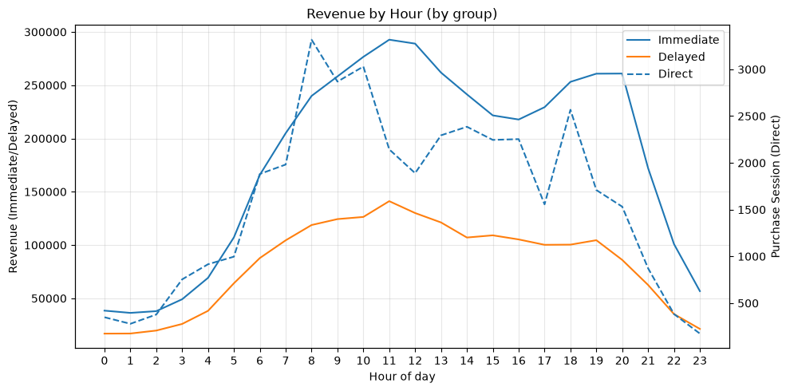

**Insight:** Identifies peak commercial periods for campaign and operational planning.

### Product & Category

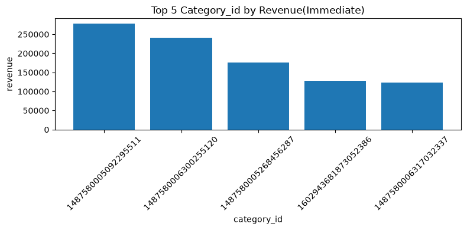

**Insight:** Identifies high-revenue categories within each purchase path.

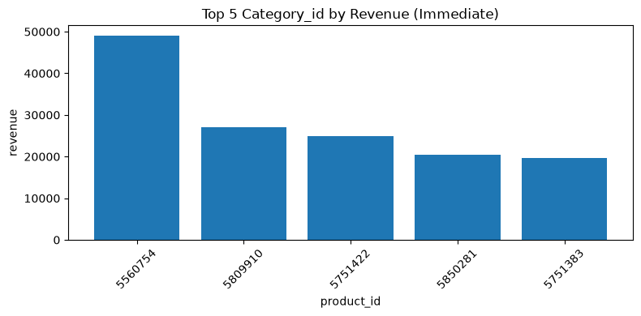

**Insight:** Identifies products with the strongest direct revenue contribution.

## Recommendations

### Short-Term

**1. Prioritize cart-to-purchase friction reduction.**  
The 86.5% drop-off from View + Cart to Purchase is the clearest optimization target. Review checkout usability, payment failures, shipping/cost disclosure, stock availability, and cart persistence.

**2. Build a delayed-conversion recovery journey.**  
Because Delayed purchases contribute roughly 31% of purchase sessions and 31% of revenue, test targeted reminders, personalized product follow-ups, and cart recovery journeys.

**3. Prioritize high-contribution products and categories.**  
Use the top-product and top-category analysis to strengthen merchandising exposure around proven demand rather than treating every SKU equally.

**4. Align promotional activity with observed demand windows.**  
Use weekday and hour-level revenue patterns to schedule campaigns and allocate operational resources.

### Long-Term

**1. Build an automated funnel monitoring layer.**  
Track stage conversion, drop-off, and path mix continuously instead of relying on periodic notebook analysis.

**2. Add cohort and retention analytics.**  
Extend the New/Returning analysis into cohort retention, repeat purchase rate, time-to-second-purchase, and customer lifetime value.

**3. Introduce experimentation.**  
Turn the funnel bottlenecks into explicit A/B testing programs for checkout UX, pricing communication, recovery messaging, and product-page design.

**4. Enrich the analytical model.**  
The current dataset contains substantial missingness in `category_code` and `brand`. A production-grade model should improve product taxonomy and brand coverage before using these fields for detailed commercial strategy.

## Final Takeaway

This project demonstrates how high-volume e-commerce event data can be transformed into an actionable customer-journey story: the analysis isolates the biggest funnel losses, quantifies the economic contribution of different purchase paths, and connects behavior to time, customer mix, products, and categories. The strongest commercial opportunity identified by the current analysis is to improve the transition from cart to purchase while protecting and expanding the substantial revenue contribution generated through both Immediate and Delayed purchase behavior.

## What This Project Demonstrates

### Technical Skills

- Large-scale CSV ingestion and concatenation
- Data-quality profiling
- Missing-value assessment
- Datetime parsing
- Session-level feature engineering
- Funnel construction
- Behavioral segmentation
- KPI aggregation
- Cohort-style new/returning classification
- Time-series aggregation
- Product/category analysis
- Matplotlib-based visualization
- Pandas groupby, pivot, merge, and transformation workflows

### Analytical Skills

- Translating raw events into business stages
- Separating descriptive metrics from sequential funnel logic
- Comparing behavioral paths by commercial value
- Identifying high-impact bottlenecks
- Prioritizing insights by revenue relevance

### Business Skills

- Product/growth funnel thinking
- Commercial KPI interpretation
- Merchandising prioritization
- Customer lifecycle analysis
- Turning data findings into short- and long-term actions
- Communicating analytical findings to non-technical stakeholders
